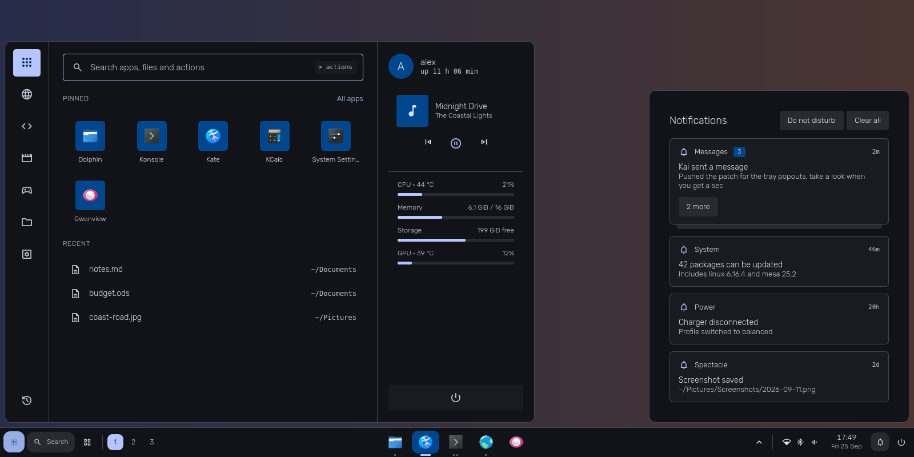
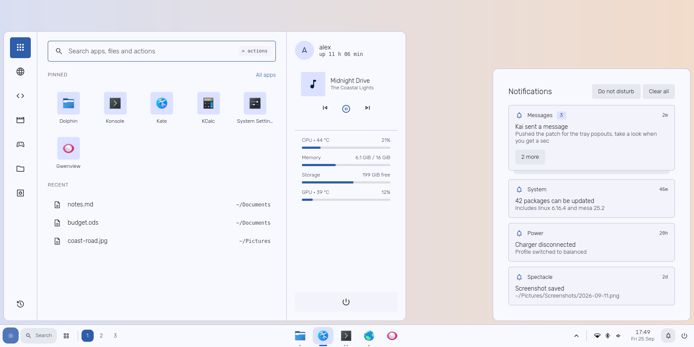
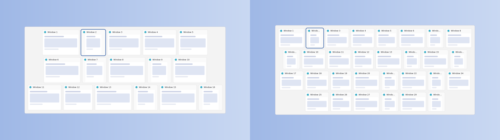

# Tidewater

A clean, Windows 11-style desktop for KDE Plasma 6: a new panel, start menu,
quick settings, notification centre, Alt+Tab and window previews, in its own
light and dark colours. Built from normal Plasma widgets. No sudo, nothing
outside your home folder, and one command puts your old desktop back.

## Requirements

- KDE Plasma 6
- `python3` (start menu), NetworkManager / `nmcli` (Wi-Fi, Ethernet),
  PipeWire / `wpctl` (volume, microphone), BlueZ / `bluetoothctl` (Bluetooth).
  Anything missing just shows as unavailable; the installer tells you.
- Optional: Baloo file indexing, for file results in the start menu search

## Install

    git clone https://github.com/addition-official/tidewater.git
    cd tidewater
    ./install.sh

Or download the ZIP from GitHub (Code > Download ZIP), unzip it, open a
terminal in the folder and run `./install.sh`. Before changing anything it
backs up your panels and colours.

## Update

Get the new version (`git pull`, or a fresh download), then run `./install.sh`
again. It updates the widgets and keeps your panel, taskbar settings, pinned
apps and clock options.

## Options

    ./install.sh --rebuild       rebuild the panel from scratch (settings are carried over)
    ./install.sh --floating      rebuild as a floating bar
    ./install.sh --islands       rebuild as three floating islands
    ./install.sh --full          rebuild as a full-width bar (the default)
    ./install.sh --all-screens   a bar on every monitor (default: main monitor only)
    ./install.sh --dark / --light   force a colour mode (default: keeps yours)
    ./install.sh --widgets-only  just install the widgets, to add them yourself

## Undo

    ./uninstall.sh

Puts back your panels, colours and Alt+Tab from before Tidewater went on your
panel, and removes its widgets, fonts and colour schemes. Your setup as it is
at that moment is saved first, so an uninstall can be undone too. Backups stay
in `~/.local/share/tidewater/backups` and are never deleted.

    ./uninstall.sh --latest              restore the most recent backup instead
    ./uninstall.sh --latest --keep-widget   e.g. get back the panel you had
                                            before a --rebuild

## What's in it

- **Panel:** start button, Search, overview, workspace pills, taskbar,
  tray, network/Bluetooth/volume, clock, notification bell, power
- **Taskbar:** live window previews on hover, drag icons to reorder them,
  pinned apps, left or centred icons (right-click an empty spot for settings)
- **Start menu** (click the button or press Meta): search across apps, files
  and actions (type `>` for actions), pinned apps, categories, recent files,
  now playing, CPU/memory/storage/GPU. Right-click an app to pin it, or for
  its own actions, like a browser's "New private window"
- **Quick settings:** Wi-Fi, Ethernet, Bluetooth, microphone, do not disturb,
  night light, volume and brightness
- **Clock:** calendar, optional seconds, 12- or 24-hour time, and the date in
  any order you like (right-click > Configure)
- **Notification centre:** grouped by app, Do not disturb, Clear all
- **Alt+Tab** in the Windows 11 style: centred rows of window cards sized to
  each window; hover for X, Delete closes the selected one
- Light and dark colour schemes; Rubik and Material Symbols fonts

## Known limits

- The panel is designed for the bottom of the screen, horizontal, about 52 px
  tall. Vertical or much thinner panels will look wrong.
- The start menu needs about 930 x 670 of screen space, so it doesn't fit on
  small or heavily scaled screens (e.g. 1366 x 768 at 125 %).
- Live window thumbnails need Wayland; on X11 previews show the app icon.

## Troubleshooting

Plasma's own network or volume icon shows up in the tray:

    ./tidy-tray.sh

A change doesn't show up:

    ./restart-plasma.sh      restarts Plasma's panels and widgets properly

Logs and the widgets' data, for bug reports:

    journalctl --user -b | grep -iE 'tidewater|qml'
    bash ~/.local/share/plasma/plasmoids/tidewater.status/contents/code/helper.sh status
    python3 ~/.local/share/plasma/plasmoids/tidewater.start/contents/code/menu.py apps

## Project layout

- `plasmoids/*`   one Plasma widget per piece
- `common/`       shared: colour engine (Scheme.js), icon font, buttons, command runner
- `plasmoids/status/contents/code/helper.sh`  quick settings: every system read and switch
- `plasmoids/start/contents/code/menu.py`     start menu: apps, recent files, stats, media
- `switcher/`     Alt+Tab
- `layout.js`     the panel arrangement (a Plasma desktop script)
- `colors/`, `fonts/`  colour schemes; Rubik and Material Symbols

## A note on how this was built

The code in Tidewater was written by AI, working under my direction. I didn't
write it by hand, and I want to be upfront about that.

What's mine: the project and what it should be. I decided on Windows 11's
layout and behaviour on KDE Plasma 6 and picked the features: Alt+Tab in rows,
live window previews, pinning, drag to reorder, the same taskbar on every
desktop. I made the design calls, threw out versions that didn't work, and
tested every build on my own machine (Plasma 6, Wayland, two monitors). Most of
the bugs that got fixed were ones I found, reported and chased down, sometimes
against the AI's own wrong guesses.

The AI also reviewed the code for bugs and security issues, and wrote this
README.

## License and credits

Copyright (C) 2026 addition-official.
Tidewater is free software under the GNU General Public License, version 3 or
later; see LICENSE.

Tidewater builds on [remapprShell](https://github.com/Wolffyx/remapprShell) by
Marius Gabriel Lupu (Copyright (C) 2026, GPL-3.0). These parts come from it and
were modified for Tidewater:

- the colour engine: `common/Scheme.js`
- the colour schemes: `colors/TidewaterLight.colors`, `colors/TidewaterDark.colors`
- the Alt+Tab switcher: `switcher/tidewater-switcher/`
- parts of the overall design

Fonts: Rubik (SIL Open Font License, `fonts/OFL-Rubik.txt`) and Material
Symbols Rounded (Apache License 2.0, `fonts/LICENSE-MaterialSymbols.txt`).
