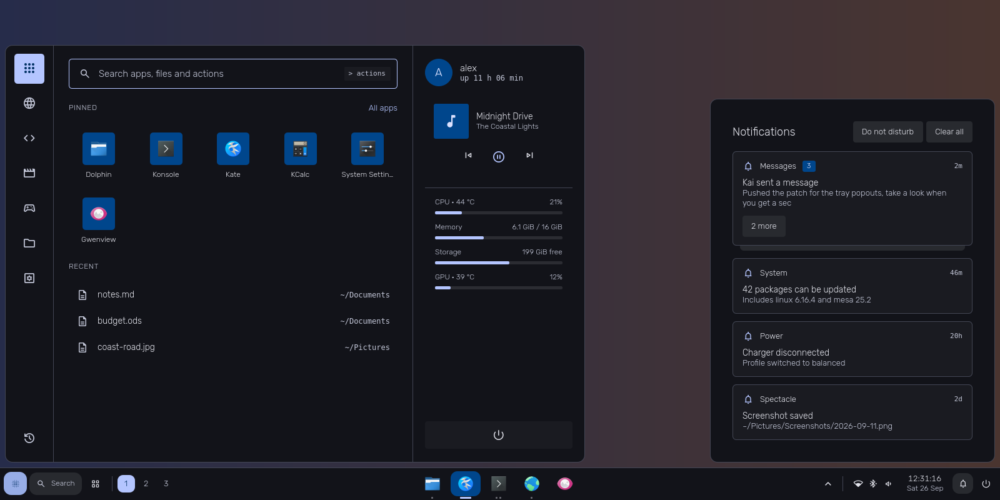
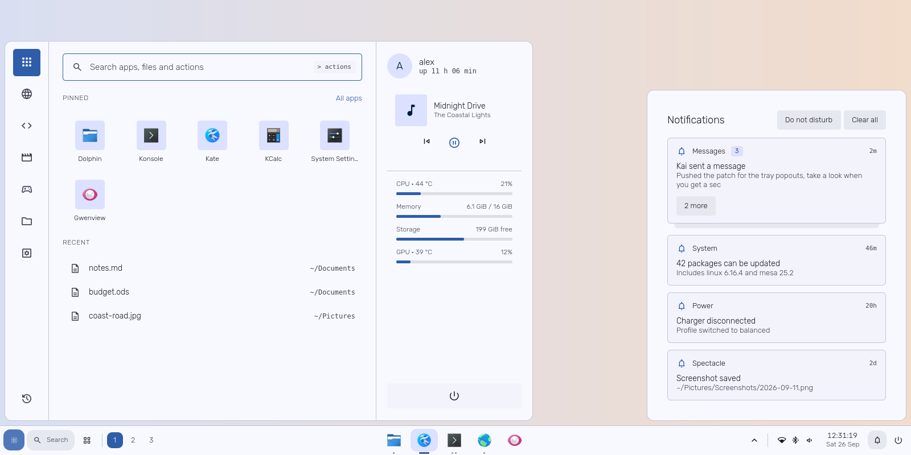
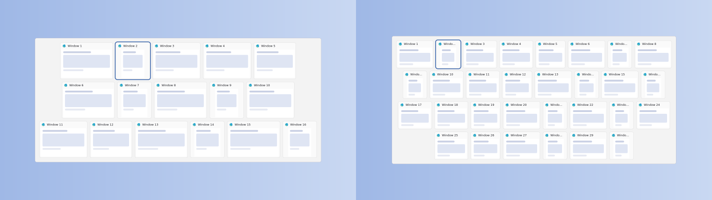

# Tidewater

A clean, Windows 11-style desktop for KDE Plasma 6: a new panel, start menu,
quick settings, notification center, Alt+Tab and window previews, in its own
light and dark colors. Built from normal Plasma widgets. No sudo, nothing
outside your home folder, and one command puts your old desktop back.

## Requirements

- KDE Plasma 6 with Qt 6.7 or newer (developed and tested on Plasma 6.6,
  Wayland, two monitors)
- `busctl` (part of systemd; required)
- `python3` (start menu), NetworkManager / `nmcli` (Wi-Fi, Ethernet),
  PipeWire / `wpctl` (volume, microphone), BlueZ / `bluetoothctl` (Bluetooth).
  Anything missing just shows as unavailable; the installer tells you.
- Optional: `pactl` (volume changes show up instantly instead of every few
  seconds), Baloo file indexing (file results in the start menu search),
  `nvidia-smi` (the GPU meter on NVIDIA cards)

## Install

    git clone https://github.com/addition-official/tidewater.git
    cd tidewater
    ./install.sh

Or download the ZIP from GitHub (Code > Download ZIP), unzip it, open a
terminal in the folder and run `./install.sh`. Before changing anything it
backs up your panels and colors.

## Update

Get the new version (`git pull`, or a fresh download), then run `./install.sh`
again. It updates the widgets and keeps your panel, settings and pinned apps.

## Options

    ./install.sh --rebuild       rebuild the panel from scratch: your settings, and the
                                 style and screens you last built with, are kept
    ./install.sh --floating      rebuild as a floating bar
    ./install.sh --islands       rebuild as three floating islands
    ./install.sh --full          rebuild as a full-width bar (the default)
    ./install.sh --all-screens   rebuild with a bar on every monitor
    ./install.sh --primary       rebuild with a bar on the main monitor only (the default)
    ./install.sh --dark / --light   rebuild in a forced color mode (default: keeps yours)
    ./install.sh --widgets-only  just install the widgets, to add them yourself
    ./install.sh --help          all of the above

Every option except `--widgets-only` rebuilds the panel. A rebuild keeps the
color scheme you picked yourself, unless you ask for `--light` or `--dark`.

## Undo

    ./uninstall.sh

Puts back your panels, colors and Alt+Tab from before Tidewater last went on
your panel, and removes its widgets, fonts and color schemes. It restores
those settings files as a whole, so other changes made to them since (like a
new wallpaper) go back too. Your setup as it is at that moment is saved first,
in `~/.local/share/tidewater/backups/<time>-pre-uninstall`, so you can copy it
back by hand if you change your mind. Backups are never deleted.

    ./uninstall.sh --latest              restore the most recent backup instead
    ./uninstall.sh --keep-widget         restore, but leave the widgets installed
    ./uninstall.sh --latest --keep-widget   e.g. get back the panel you had
                                            before a --rebuild
    ./uninstall.sh --help

To remove Tidewater as if it had never been installed, use `--purge`. It does
the same uninstall, then also deletes everything else Tidewater left behind:
`~/.local/share/tidewater` (backups included), its cache and state files, and
Plasma's compiled widget cache (Plasma rebuilds it). It lists what will go and
asks you to type `delete` first. With the backups gone, this can't be undone.

    ./uninstall.sh --purge
    ./uninstall.sh --purge --yes         the same without asking (for scripts)

## What's in it

- **Panel:** start button, Search, overview, workspace pills, taskbar,
  tray, network/Bluetooth/volume, clock, notification bell, power
- **Taskbar:** live window previews on hover (in a rounded card), drag icons
  to reorder them, pinned apps, left or centered icons. Clicking an app with
  several windows opens its card at once, so you pick the window; the long
  dot under an app marks which of its windows is active
- **Start menu** (click the button or press Meta): search across apps, files
  and actions (type `>` for actions), pinned apps, categories, recent files,
  now playing, CPU/memory/storage/GPU. Right-click an app to pin it, or for
  its own actions, like a browser's "New private window"
- **Quick settings:** Wi-Fi, Ethernet, Bluetooth, microphone, do not disturb,
  night light, volume and brightness
- **Clock:** a calendar that scrolls smoothly week by week (so the end of one
  month and the start of the next show together), optional seconds, 12- or
  24-hour time, and the date in any order you like
- **Notification center:** grouped by app, Do not disturb, Clear all
- **Alt+Tab** in the Windows 11 style: centered rows of window cards sized to
  each window; hover for X, Delete closes the selected one
- **Settings:** one page for the whole panel, on every monitor. Right-click
  the start button > Configure, or right-click any Tidewater piece >
  Tidewater settings...
  - start button: Tidewater's own icon, one from your icon theme, or your own
    picture (SVG, PNG, JPEG, WebP)
  - Search: icon and "Search", icon only, or hidden
  - overview button, dividers, power button: shown or hidden
  - desktops: numbered pills, dots, or hidden
  - taskbar: icons centered or on the left, icon size, fill the bar, apps from
    all desktops or just the current one
  - clock: seconds, 12- or 24-hour time, the date and its format

  The defaults are the look shown above. A hidden piece takes almost no space,
  just Plasma's small gap between widgets (Plasma's own right-click > Remove
  still works too). The settings page belongs to Tidewater's start button: if
  you use another menu instead, the taskbar and clock keep the settings they
  had, but there is no page to change them. Settings made in an older
  version's taskbar or clock settings are moved over by themselves.
- Light and dark color schemes; Rubik and Material Symbols fonts

## Known limits

- The panel is designed for the bottom of the screen, horizontal, about 52 px
  tall. Vertical or much thinner panels will look wrong.
- The start menu needs about 930 x 670 of screen space, so it doesn't fit on
  small or heavily scaled screens (e.g. 1366 x 768 at 125 %).
- Live thumbnails in the taskbar previews need Wayland; on X11 they show the
  app icon. (Alt+Tab's thumbnails work on both.)
- Right-to-left languages and panels at the top or sides haven't been tested.

## Troubleshooting

Plasma's own network or volume icon shows up in the tray:

    ./tidy-tray.sh

A change doesn't show up:

    ./restart-plasma.sh      restarts Plasma's panels and widgets properly

Logs and the widgets' data, for bug reports:

    journalctl --user -b | grep -iE 'tidewater|qml'
    bash ~/.local/share/plasma/plasmoids/tidewater.status/contents/code/helper.sh status
    python3 ~/.local/share/plasma/plasmoids/tidewater.start/contents/code/menu.py apps

## Project layout

- `plasmoids/*`   one Plasma widget per piece
- `common/`       shared QML (color engine Scheme.js, icon glyphs, buttons, command
  runner). `install.sh` copies it into every widget, so install with `./install.sh`
  rather than `kpackagetool6` directly
- `shared/`       Tidewater's settings (`Settings.qml`), one object shared by every
  widget. `install.sh` copies it to `~/.local/share/tidewater/qml` (under
  `$XDG_DATA_HOME` if set), and each widget imports it from there by a relative
  path (`../../../../../tidewater/qml` from its `contents/ui`). The values are
  saved in the start widget's settings; its Configure page
  (`plasmoids/start/contents/ui/ConfigGeneral.qml`) is the settings page
- `plasmoids/status/contents/code/helper.sh`  quick settings: every system read and switch
- `plasmoids/start/contents/code/menu.py`     start menu: apps, recent files, stats, media
- `switcher/`     Alt+Tab
- `layout.js`     the panel arrangement (a Plasma desktop script)
- `colors/`, `fonts/`  color schemes; Rubik and Material Symbols

## A note on how this was built

The code in Tidewater was written by AI, working under my direction. I didn't
write it by hand, and I want to be upfront about that.

What's mine: the project and what it should be. I decided on Windows 11's
layout and behavior on KDE Plasma 6 and picked the features: Alt+Tab in rows,
live window previews, pinning, drag to reorder, the same taskbar on every
desktop. I made the design calls, threw out versions that didn't work, and
tested every build on my own machine (Plasma 6, Wayland, two monitors). Most of
the bugs that got fixed were ones I found, reported and chased down, sometimes
against the AI's own wrong guesses.

The AI also reviewed the code for bugs and security issues, and wrote this
README.

## License and credits

Copyright (C) 2026 addition-official.
Tidewater is free software under the GNU General Public License, version 3 or
later; see LICENSE.

Tidewater builds on [remapprShell](https://github.com/Wolffyx/remapprShell) by
Marius Gabriel Lupu (Copyright (C) 2026, GPL-3.0-or-later). These parts come
from it and were modified for Tidewater:

- the color engine: `common/Scheme.js`
- the color schemes: `colors/TidewaterLight.colors`, `colors/TidewaterDark.colors`
- the Alt+Tab switcher: `switcher/tidewater-switcher/`
- parts of the overall design

Fonts: Rubik (SIL Open Font License, `fonts/OFL-Rubik.txt`) and Material
Symbols Rounded (Apache License 2.0, `fonts/LICENSE-MaterialSymbols.txt`).
